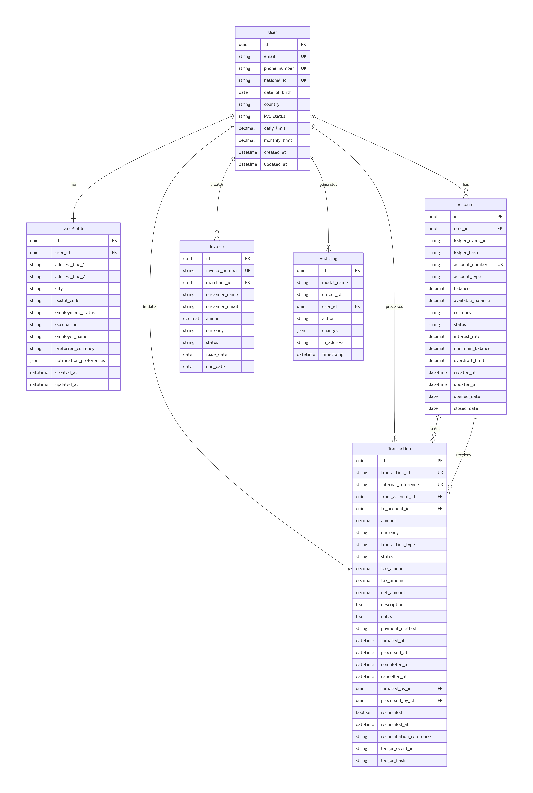

# PesaPal RDBMS Challenge


[👉 Try User Registration](https://pesapal-rdbms-gm67.onrender.com/register/)

## Live Demo

**Live URL:** [https://pesapal-rdbms-gm67.onrender.com](https://pesapal-rdbms-gm67.onrender.com)

PesaPal RDBMS is a Django-based financial application that solves the critical problem of data integrity and auditability in payment systems. It goes beyond a basic CRUD app by implementing core financial principles: an immutable cryptographic ledger for tamper-proof records, ACID-compliant PostgreSQL transactions, and a secure custom user model. It's a demonstration of how to build a reliable, auditable data layer for real-world financial operations.

## 🎯 The Challenge I Solve

Building financial applications requires **absolute data reliability**. A single misplaced decimal or failed transaction can mean real financial loss. Traditional databases don't guarantee the ACID properties needed for payments.

### **My Solution**
PesaPal RDBMS implements:
- **Atomic transactions** - Money transfers succeed completely or fail completely
- **Immutable audit logs** - Every financial action is permanently recorded
- **Referential integrity** - No orphaned transactions or broken relationships
- **Real-time consistency** - Balances are always accurate, never eventually consistent
- **Complex Queries**: Enables powerful fraud detection and reporting

### **Technology Stack:**
- **Backend:** Django 6.0 + Django REST Framework
- **Database:** PostgreSQL (ACID-compliant RDBMS)
- **Deployment:** Render.com
- **Web Server:** Gunicorn + WhiteNoise
- **Authentication:** Django Session + REST Framework



## 📋 Table of Contents
- [Features](#features)
- [Architecture](#architecture)
- [Quick Start](#quick-start)
- [Documentation](#documentation)
- [API Reference](#api-reference)
- [Database Design](#database-design)
- [Testing](#testing)
- [Contributing](#contributing)
- [License](#license)

--- 

## Design Decisions

- **Storage**: JSON chosen for readability and ease of debugging over binary formats
- **Indexing**: Dictionary-based indexes for O(1) lookups on primary and unique keys
- **Parser**: Regex-based SQL parsing to keep scope minimal and transparent
- **Web Integration**: Django used strictly as a client to the custom RDBMS, not as a persistence layer

## Features

### **Custom RDBMS Engine**

- ✅ **Schema Management**: Create tables with various data types (INTEGER, TEXT, FLOAT, BOOLEAN, DATETIME)
- ✅ **Data Integrity**: Enforce primary key, unique, and foreign key constraints
- ✅ **Query Operations**: Full CRUD support with optimized indexing
- ✅ **Advanced Queries**: JOIN operations (INNER, LEFT, RIGHT) with proper relationship handling
- ✅ **Persistence**: JSON file storage with automatic backup/restore
- ✅ **SQL Interface**: REPL with SQL-like syntax parser

### 🌐 **Web Application**
- ✅ **RESTful API**: Fully documented endpoints with OpenAPI/Swagger
- ✅ **Web Dashboard**: Beautiful interface for database management
- ✅ **User Management**: Complete CRUD operations with authentication
- ✅ **Task System**: Demonstrate JOIN operations between users and tasks
- ✅ **SQL Executor**: Safe SQL query interface with syntax highlighting
- ✅ **Admin Interface**: Django admin with custom styling

---

## Architecture
```
pesapal_rdbms/
├── rdbms/ # Custom RDBMS Engine (No external dependencies!)
│ ├── init.py
│ ├── database.py # Main Database class
│ ├── table.py # Table implementation with CRUD
│ ├── parser.py # SQL parser (regex-based)
│ ├── repl.py # Interactive SQL REPL
│ └── storage.py # JSON persistence layer
├── web/ # Django Web Application
│ ├── manage.py
│ ├── web/ # Django project settings
│ │ ├── init.py
│ │ ├── settings.py
│ │ ├── urls.py
│ │ ├── asgi.py
│ │ └── wsgi.py
│ └── tasks/ # Django app demonstrating RDBMS
│ ├── init.py
│ ├── views.py # Web views
│ ├── services.py # Bridge to our custom RDBMS
│ ├── urls.py # URL routing
│ └── templates/ # HTML templates
├── users/ # Users Django app (optional)
├── requirements.txt # Python dependencies
└── README.md # This file
```

## Core Components

### **RDBMS Engine** (`rdbms/`)
- `database.py` - Main database class with transaction management
- `table.py` - Table implementation with indexing and constraints  
- `parser.py` - SQL-like command parser
- `storage.py` - JSON persistence with atomic writes
- `repl.py` - Interactive SQL shell

### **Web Application** (`web/`)
- Django REST API with full CRUD operations
- Service layer abstraction for RDBMS integration
- Real-time monitoring and statistics
- SQL execution interface

---

## Quick Start

### Verify Django Configuration

To confirm Django settings and database connectivity are correctly configured, run:

```bash
python check_config.py
```

## Installation & Setup

### **1. Prerequisites:**
- Python 3.8+
- pip (Python package manager)

### **2. Installation:**
```bash
# Clone or download the project
# Navigate to project directory
cd pesapal_rdbms

# Create virtual environment (recommended)
python -m venv venv

# Activate virtual environment
# On Windows:
venv\Scripts\activate
# On Mac/Linux:
source venv/bin/activate

# Install dependencies
pip install -r requirements.txt

# Set up Django database
cd web
python manage.py migrate
```

### Usage
**1. Run the RDBMS REPL:**
```bash
cd pesapal_rdbms
python -m rdbms.repl
```

## Example REPL session:

```sql
rdbms> exec CREATE TABLE users (id INTEGER PRIMARY KEY, name TEXT, email TEXT UNIQUE)
rdbms> exec INSERT INTO users (id, name, email) VALUES (1, 'John', 'john@example.com')
rdbms> exec SELECT * FROM users
rdbms> exec UPDATE users SET name = 'Jane' WHERE id = 1
rdbms> exec DELETE FROM users WHERE id = 1
```

**2. Run the Web Application:**
```bash
cd pesapal_rdbms/web
python manage.py runserver
```

Visit http://localhost:8000 to see:

- User management interface

- Task management with JOIN demonstration

- API endpoints at /api/users/ and /api/tasks/


### Authentication
Currently using session-based authentication via Django.

### Endpoints

#### Users API (`/api/users/`)
| Method | Endpoint | Description | Example Request |
|--------|----------|-------------|-----------------|
| GET | `/api/users/` | List all users | `curl -X GET http://localhost:8000/api/users/` |
| POST | `/api/users/` | Create new user | `curl -X POST -H "Content-Type: application/json" -d '{"username": "john", "email": "john@example.com"}' http://localhost:8000/api/users/` |
| GET | `/api/users/{id}/` | Get user details | `curl -X GET http://localhost:8000/api/users/1/` |
| PUT | `/api/users/{id}/` | Update user | `curl -X PUT -H "Content-Type: application/json" -d '{"email": "new@example.com"}' http://localhost:8000/api/users/1/` |
| DELETE | `/api/users/{id}/` | Delete user | `curl -X DELETE http://localhost:8000/api/users/1/` |

#### Tasks API (`/api/tasks/`)
| Method | Endpoint | Description | Example Response |
|--------|----------|-------------|------------------|
| GET | `/api/tasks/` | List all tasks with user info (JOIN) | `{"tasks": [{"id": 1, "title": "Task 1", "user": {"id": 1, "username": "john"}}]}` |
| POST | `/api/tasks/` | Create new task | Requires `title` and `user_id` |

#### SQL Executor (`/api/tasks/sql/`)
| Method | Endpoint | Description |
|--------|----------|-------------|
| POST | `/api/tasks/sql/` | Execute raw SQL queries |

**Example:**
```bash
curl -X POST -H "Content-Type: application/json" \
  -d '{"query": "SELECT * FROM users JOIN tasks ON users.id = tasks.user_id"}' \
  http://localhost:8000/api/tasks/sql/
  ```

### Demonstration of Requirements

**✅ Table Declaration:**
```python
db.create_table("users", 
    {"id": "INTEGER", "name": "TEXT", "email": "TEXT"},
    primary_key="id",
    unique_keys=["email"]
)
```

**✅ CRUD Operations:**
- Create: table.insert({"id": 1, "name": "John"})

- Read: table.select({"id": 1})

- Update: table.update({"name": "Jane"}, {"id": 1})

- Delete: table.delete({"id": 1})_

**✅ Primary & Unique Keys:**
- Primary key enforcement prevents duplicate IDs

- Unique key enforcement prevents duplicate emails

**✅ Basic Indexing:**
- Automatic indexing on primary and unique keys

- Faster lookups using indexes

**✅ JOIN Operations:**
```python
tasks.join(users, "user_id", "id", "LEFT")
```

**✅ SQL Interface:**
```sql
SELECT * FROM users WHERE id = 1
INSERT INTO users (id, name) VALUES (2, 'Alice')
UPDATE users SET name = 'Bob' WHERE id = 2
DELETE FROM users WHERE id = 2
```

**✅ REPL Mode:**
- Interactive SQL shell for testing queries

**✅ Web App Demonstration:**
Full CRUD application using the custom RDBMS

---

## Database Design

### Entity Relationship Diagram


### Schema Definition

```sql
-- Users Table
CREATE TABLE users (
    id INTEGER PRIMARY KEY AUTOINCREMENT,
    username VARCHAR(50) UNIQUE NOT NULL,
    email VARCHAR(100) UNIQUE NOT NULL,
    password_hash VARCHAR(255) NOT NULL,
    role VARCHAR(20) DEFAULT 'user',
    created_at TIMESTAMP DEFAULT CURRENT_TIMESTAMP,
    updated_at TIMESTAMP DEFAULT CURRENT_TIMESTAMP
);

-- Tasks Table (Demonstrates JOIN operations)
CREATE TABLE tasks (
    id INTEGER PRIMARY KEY AUTOINCREMENT,
    user_id INTEGER NOT NULL,
    title VARCHAR(200) NOT NULL,
    description TEXT,
    status VARCHAR(20) DEFAULT 'pending',
    priority VARCHAR(20) DEFAULT 'medium',
    due_date DATE,
    created_at TIMESTAMP DEFAULT CURRENT_TIMESTAMP,
    updated_at TIMESTAMP DEFAULT CURRENT_TIMESTAMP,
    FOREIGN KEY (user_id) REFERENCES users(id) ON DELETE CASCADE
);

-- Indexes for Performance
CREATE INDEX idx_tasks_user_id ON tasks(user_id);
CREATE INDEX idx_tasks_status ON tasks(status);
CREATE INDEX idx_users_username ON users(username);
```
---

## Testing 

### Running Tests
```bash
# Run all tests
python -m pytest

# Run specific test module
python -m pytest tests/test_database.py

# Run with coverage report
python -m pytest --cov=rdbms --cov-report=html
```
---

## Deployment


### **Production Deployment on Render.com**
- **Platform:** Render.com (Free Tier)
- **Database:** PostgreSQL with ACID compliance
- **URL:** https://pesapal-rdbms-gm67.onrender.com
- **Auto-deploy:** On Git push to main branch
- **SSL/HTTPS:** Automatic Let's Encrypt certificates

### **Local Development**
```bash
git clone https://github.com/Dama5323/pesapal_rdbms.git
cd pesapal_rdbms
pip install -r requirements.txt
python manage.py migrate
python manage.py runserver
```

## Authors

- **Your Name** - [GitHub](https://github.com/Dama5323) - [LinkedIn](https://linkedin.com/in/dama5323)

## Acknowledgments

- ALX Software Engineering Program
- Inspired by SQLite and minimal database implementations
- Thanks to all contributors and testers

## License

This project is licensed under the MIT License - see the [LICENSE](LICENSE) file for details.

---

<div align="center">
  Made with ❤️ for the pesapal rdbms 2026 challene/add to my portfolio 
  <br>
  <sub>If you find this useful, give it a ⭐!</sub>
</div>